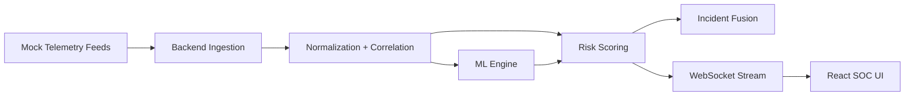

# Identity Fusion Architecture (Local First)

```mermaid
flowchart LR
  A[Mock Telemetry Feeds] --> B[Backend Ingestion]
  B --> C[Normalization + Correlation]
  C --> D[Risk Scoring]
  D --> E[Incident Fusion]
  D --> F[WebSocket Stream]
  F --> G[React SOC UI]
  C --> H[ML Engine]
  H --> D
```

The platform is built to run locally with provider adapters mocked behind stable interfaces (`ingest`, `normalize`, `correlate`, `score`, `respond`).
