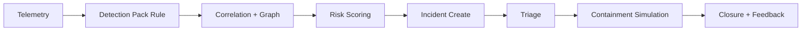

# Detection Lifecycle

```mermaid
flowchart LR
  A[Telemetry] --> B[Detection Pack Rule]
  B --> C[Correlation + Graph]
  C --> D[Risk Scoring]
  D --> E[Incident Create]
  E --> F[Triage]
  F --> G[Containment Simulation]
  G --> H[Closure + Feedback]
```
