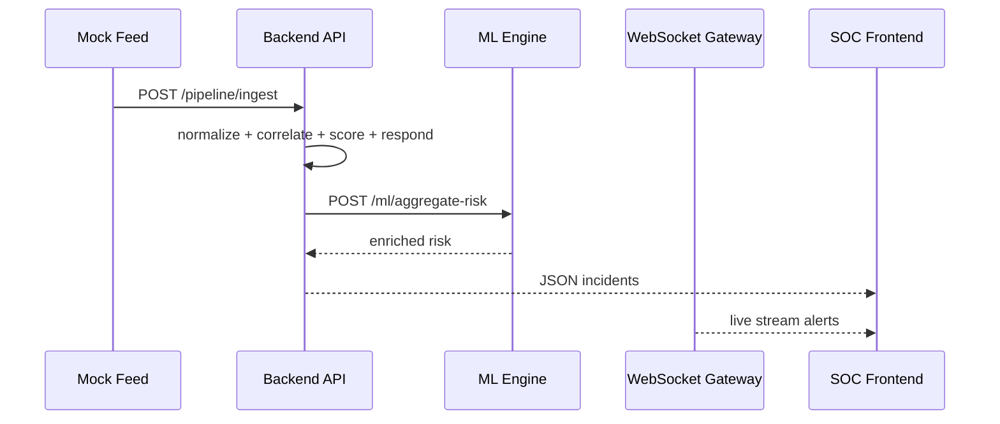

# Sequence: Ingest to Incident

```mermaid
sequenceDiagram
  participant Feed as Mock Feed
  participant API as Backend API
  participant ML as ML Engine
  participant WS as WebSocket Gateway
  participant UI as SOC Frontend

  Feed->>API: POST /pipeline/ingest
  API->>API: normalize + correlate + score + respond
  API->>ML: POST /ml/aggregate-risk
  ML-->>API: enriched risk
  API-->>UI: JSON incidents
  WS-->>UI: live stream alerts
```
